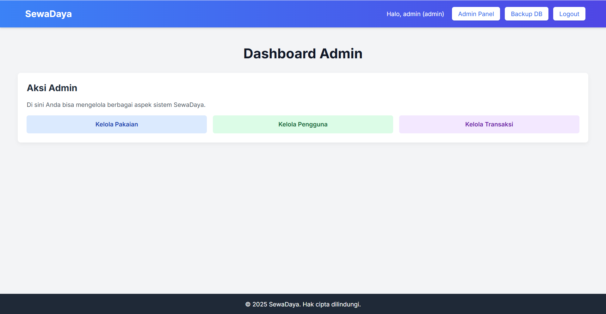
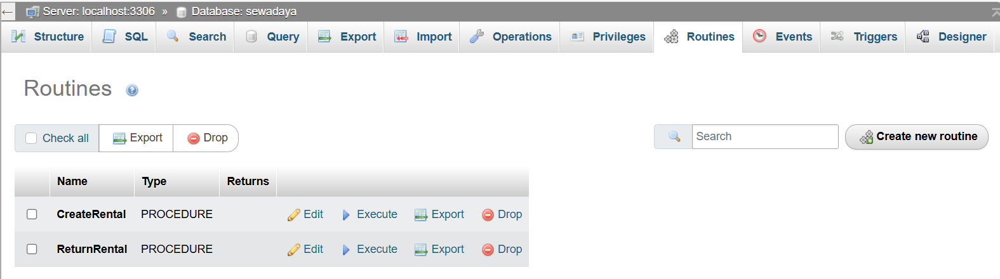

# SEWADAYA-PDT 👘
Proyek ini merupakan sistem penyewaan baju adat sederhana yang dibangun menggunakan PHP dan MySQL. Tujuannya adalah untuk mengelola penyewaan baju adat secara efisien dan aman, dengan memanfaatkan stored procedure, trigger, transaction, dan stored function. Sistem ini juga dilengkapi mekanisme backup otomatis untuk menjaga keamanan data jika terjadi hal yang tidak diinginkan. 



## 📌 Detail Konsep

### 🧠 Stored Procedure
Stored procedure bertindak seperti SOP internal yang menetapkan alur eksekusi berbagai operasi penting di sistem penyewaan baju adat. Procedure ini disimpan langsung di lapisan database, sehingga menjamin konsistensi, efisiensi, dan keamanan eksekusi, terutama dalam sistem terdistribusi atau multi-user.



Beberapa procedure penting yang digunakan:

`home.php`
* CreateRental : Mencatat penyewaan baju adat, menghitung biaya total, dan memperbarui stok
 ```php
$stmt = $pdo->prepare("CALL CreateRental(?, ?, ?, ?, ?, ?)"); 
                $stmt->execute([$user_id, $item_id, $quantity, $rental_date, $return_date, $item_data['rental_price_per_day']]);
 ```

`history.php`
* ReturnRental : Memperbarui status penyewaan menjadi returned dan mengembalikan stok
$stmt = $pdo->prepare("CALL ReturnRental(?, ?)");
        $stmt->execute([$rental_id, $actual_return_date]); 

Dengan menyimpan proses-proses ini di sisi database, sistem menjaga integritas data di level paling dasar, terlepas dari cara aplikasi mengaksesnya.

#🚨 Trigger
Trigger di Sewadaya berfungsi sebagai sistem pengaman otomatis sebelum dan sesudah perubahan data dilakukan pada tabel utama.
Trigger aktif pada proses berikut:

BeforeInsertRental: Memastikan total harga dihitung otomatis sebelum data masuk ke rentals.

AfterUpdateRentalStatus: Menyimpan log perubahan status ke tabel rental_status_log.

-- BeforeInsertRental
SET NEW.total_price = v_days * v_rental_price_per_day;

-- AfterUpdateRentalStatus
INSERT INTO rental_status_log (rental_id, old_status, new_status)
VALUES (OLD.rental_id, OLD.status, NEW.status);

Fungsi trigger ini mencakup:
Penolakan data sewa jika logika tidak valid (via rollback di procedure)
Pencatatan otomatis perubahan status
Validasi transparan di tingkat database


#🔄 Transaction (Transaksi)
Dalam sistem penyewaan, sebuah transaksi seperti peminjaman atau pengembalian baju harus dijalankan secara atomik. Semua langkah harus berhasil, atau tidak dijalankan sama sekali.

CreateRental()

try {
    $conn->beginTransaction();
    $stmt = $conn->prepare("CALL CreateRental(?, ?, ?, ?, ?, ?)");
    $stmt->execute([...]);
    $conn->commit();
} catch (PDOException $e) {
    $conn->rollBack();
    throw new Exception("Penyewaan gagal: " . $e->getMessage());
}

ReturnRental()
<?php
try {
    $pdo->beginTransaction();

    $stmt = $pdo->prepare("CALL ReturnRental(?, ?)");
    $stmt->execute([$rental_id, $actual_return_date]);
    $pdo->commit();
    setMessage('Pengembalian berhasil dicatat.', 'success');
} catch (PDOException $e) {
    // Rollback jika ada kesalahan
    $pdo->rollBack();
    setMessage('Gagal mencatat pengembalian: ' . $e->getMessage(), 'error');
}


#📺 Stored Function

Stored function digunakan untuk membaca informasi penting dari database tanpa mengubah data. Contoh pada proyek ini:
views>rentals>my_rentals.php
CalculateOverdueDays : Menghitung jumlah hari keterlambatan pengembalian
$stmt_overdue = $pdo->prepare("SELECT CalculateOverdueDays(?) AS overdue_days");
                            $stmt_overdue->execute([$rental['rental_id']]);
                            $overdue_days_result = $stmt_overdue->fetch(PDO::FETCH_ASSOC);
                            $overdue_days = $overdue_days_result['overdue_days'];

GetUserTotalRentals : Mengembalikan total transaksi penyewaan oleh user:
$stmt_total = $pdo->prepare("SELECT GetUserTotalRentals(?) AS total");
        $stmt_total->execute([$_SESSION['user_id']]);

Logika pembacaan ini disatukan di database layer, menjaga konsistensi antar modul aplikasi.


#🔄 Backup Otomatis

Untuk menjaga ketersediaan dan keamanan data, sistem dilengkapi fitur backup otomatis menggunakan mysqldumpdan task scheduler. Backup dilakukan secara berkala dan disimpan dengan nama file yang mencakup timestamp, sehingga mudah ditelusuri. Semua file disimpan di direktori sewadaya/backups.

backup.php
$command = escapeshellarg($mysqldump_path) . " -u" . escapeshellarg(DB_USER) .
               (DB_PASS ? " -p" . escapeshellarg(DB_PASS) : "") . " " .
               escapeshellarg(DB_NAME) . " > " . escapeshellarg($filepath) . " 2>&1"; 

    $output = null;
    $return_var = null;
    exec($command, $output, $return_var);

#🧩 Relevansi Proyek dengan Pemrosesan Data Terdistribusi
Sistem ini dirancang dengan memperhatikan prinsip-prinsip dasar pemrosesan data terdistribusi:

Konsistensi: Semua transaksi dikontrol dengan stored procedure dan validasi di database.
Reliabilitas: Trigger dan transaction menjamin tidak ada data yang rusak meskipun ada kesalahan input.
Integritas: Logika disimpan di database sehingga sistem tetap valid, terlepas dari bagaimana ia diakses (web/API/etc).
